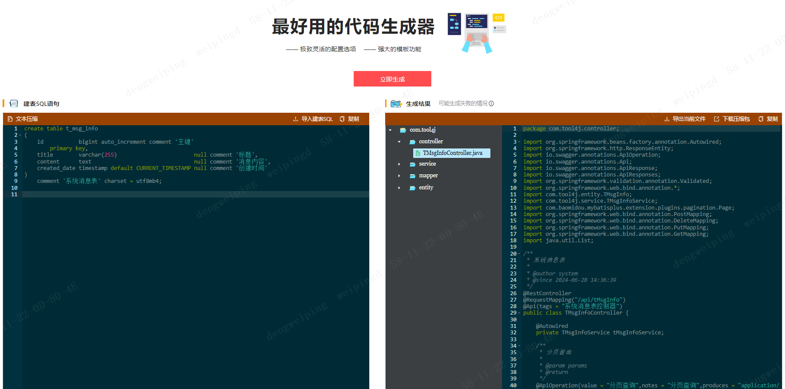
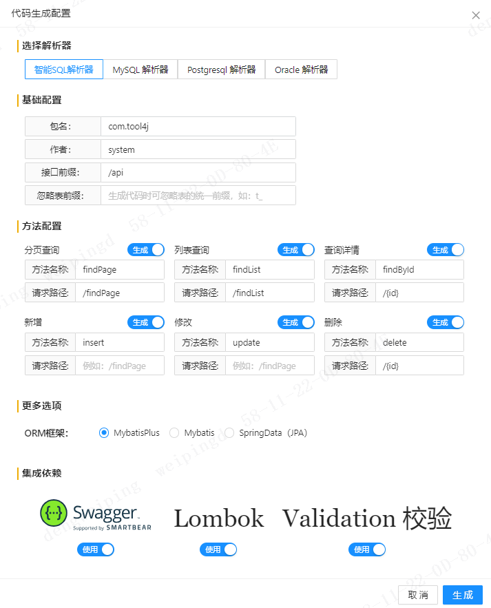

# Java代码生成器开源版

## 在线地址
Java在线代码生成器：[在线访问](https://tool4j.com/#/code-generate)

## 项目截图

## 目录结构

**前端：** [tool4j-generator-ui](https://gitee.com/dwp1216/tool4j-generator-ui)

**后台：** [tool4j-generator](https://gitee.com/dwp1216/tool4j-generator)

## 本地运行
可直接 clone 该项目到本地，无需修改任何内容即可运行

**后端：**
1. 使用Maven安装依赖
2. 运行 Tool4jGeneratorApplication.java

**前端：**
1. 切换到前端工程根目录
2. 安装依赖： npm i
2. 运行：umi dev

## 项目特点
- 使用 freemarker 模板引擎，支持自定义代码模板
- 支持Mybatis、MybatisPlus、Jpa代码生成
- 使用 antlr4 解析SQL语句，保证了SQL解析的成功率
- 支持自定义包名、作者名信息
- 支持自定义方法名、接口地址
- 支持自定义选择是否生成某个方法
- 支持选择是否集成Swagger、Lombok、validation等依赖

## 技术介绍
**前端：** React 16.8.6、Ant-design 4.24.12、Umi 3.5.41

**后端：** Java 1.8、SpringBoot2.3.4.RELEASE、knife4j（Swagger）2.0.9、Freemarker 2.3.31

## 运行环境
**服务器：** 腾讯云2核2G

**最低配置：** 1核2G服务器

## 开发环境

**开发工具:** IDEA

**JDK:** 1.8